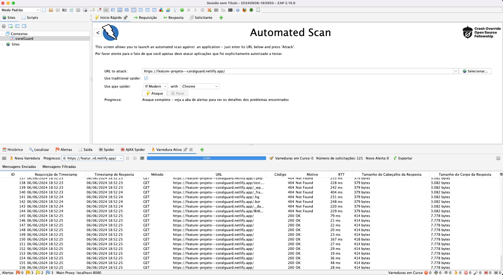

# 🌊 CoralGuard Systems 🌊

## Descrição do Projeto
CoralGuard Systems é um projeto inovador focado na preservação dos recifes de corais, combinando tecnologia avançada com um compromisso inabalável com a conservação marinha. Este projeto foi desenvolvido como parte de um trabalho de faculdade pelos seguintes estudantes:

- **Karen Cristina Nascimento Francisco - RM 551126**
- **Nayla Souza Ribeiro - RM 99035**
- **Manuela Amélia Archanjo dos Santos - RM 552097**

## Problemas Abordados
Os oceanos enfrentam desafios críticos que ameaçam sua saúde e biodiversidade. A degradação dos recifes de corais, poluição marinha e pesca ilegal são problemas significativos que o CoralGuard Systems busca mitigar, alinhando-se com o Objetivo de Desenvolvimento Sustentável 14 (ODS 14): Vida na Água.

## Solução
O CoralGuard Systems oferece uma plataforma digital inovadora e um robô coral, o CoralBot, equipado com sensores de última geração para monitorar e proteger os oceanos de forma sustentável.

## Características Principais
- **📊 Monitoramento da Qualidade da Água:** Medição de pH e detecção de poluentes.
- **🚨 Detecção de Atividades Ilegais:** Identificação de pesca ilegal e atividades suspeitas.
- **⚗️ Regulação do pH:** Liberação de bicarbonato de cálcio para neutralizar a acidez da água.
- **🐠 Integração Natural:** Design em forma de coral para integração discreta no ambiente marinho.
- **🌐 Engajamento Comunitário:** Plataforma interativa para participação de biólogos e a comunidade científica.

## Estrutura do Projeto

### Diretórios e Arquivos
- `index.html`: Página principal do site.
- `participe.html`: Página com vídeos e fóruns de discussão.
- `css/`: Diretório contendo os arquivos CSS.
  - `style.css`: Estilos do projeto.
- `js/`: Diretório contendo os arquivos JavaScript.
  - `script.js`: Scripts do projeto.
- `midia/`: Diretório contendo as mídias utilizadas no projeto (imagens, vídeos).

## Como Rodar o Projeto
Basta abrir o arquivo `index.html` no seu navegador.

### SonarCloud
Os testes de qualidade de código são realizados utilizando o [SonarCloud](https://sonarcloud.io/summary/overall?id=naylasouza_CoralGuardSystems).

### Zap

